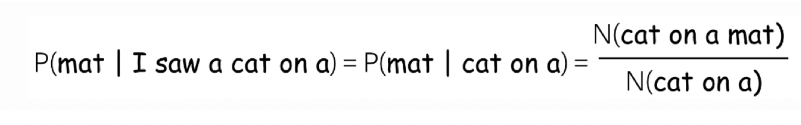
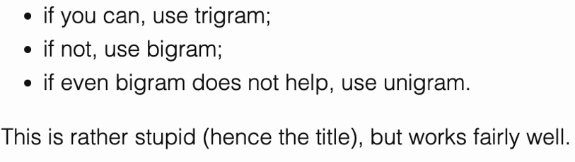

* introduce the Language modeling
* CNN and RNN langauge modeling introducition
* code implemention

  > https://lena-voita.github.io/nlp_course/language_modeling.html

# language modeling

language modeling is to assign a probability to a sentence. Formally, in natural language processing, language aims to construct an efficient approximation to the probability measure on the set of expressions in the language learned from a sampling data set. 

## Statistic language model

let $x_1, x_2, x_3,...,x_n$ be tokens in a sentence. and $P(x_1, x_2, x_3,...,x_n)$ be the probability of these tokens. Using the product rule of probability (the chain rule), we get the statistic language model:



$$P(x_1, x_2, x_3,...,x_n) = P(x_1)P(x_2|x_1)P(x_3|x_2,x_1)...P(x_n|x\_1,...,x\_*{n-1})$$



We docomposed the probability of a text into conditional probabilities of each token given the previous context. So we got a left-to-right language model. 

## N-gram langauge model

But how we compute the probability $P(x_t|x_1,...,x_{n-1})$. So we need to introduce the **Markov property** and **smoothings**
The straighforward way to compute the $P(x_t|x_1,...,x_{n-1})$ is:



$P(x_t|x_1,...,x_{t-1}) = \frac{N(x_1,x_2,...,x_t)}{N(x_1,x\_2,...,x_{t-1})}$. 



Usually, it doesn't work well because $x_1,x_2,...,x_t$ do not occur in a corpus and therefore, will zero out the probability of the sentence. 

### Markov property

To address the above problem, we need to make a independence assumption:

**The probability of a word only depends on a fixed number of previous words**

For example:

- n=3(trigram model): $P(x_t|x_1,x_2,...,x_{t-1}) = P(x_t|x_{t-1},x_{t-2})$

- n=2(bigram model): $P(x_t|x_1,x_2,...,x_{t-1}) = P(x_t|x_{t-1})$

- n=1(unigram model): $P(x_t|x_1,x_2,...,x_{t-1}) = P(x_t)$

### Smoothing

For example:

it is not good if the denominator or numerator is zero. To avoid this problem, we will use smoothings. 

#### avoid zeros in the denomiantor

* one of the method is to use less context. This is called **backoff** :

  
* More clever:

  

#### aovid zeros in numerator

## Neural based language model

**The inability to use long context is the main shortcoming of n-gram language model**

In our general left-to-right languaage modeling framework, the probability of a token sentence is:

$$P(x_1,x_2,...,x_n) = P(x_1)P(x_2|x_1)P(x_3|x_1,x_2).....P(x_n,|x_1,...,x_{n-1})=\prod\limits_{t=1}^nP(x_t|x<t)$$

Differenctly from n-gram models that define formulas based on global corpus statistics, neural models teach a network to predict these probabilities. 
So we want to to use **neural network** to compute the conditional probability: $P(x_t|x_1,x_2,...,x_{t-1})$

Actually, neural network models always to two things:

* process context: 
  The main idea here is to get representation for the previous context. Then the model predict the probability distribution for the next token. This model could be different depending on the model architecture. (RNN, CNN, what ever you want)
* generate the probability distribution for the next token:
  Once the text has been encoded, Usually the probability distribution is generated in the same way. we usually has an hidden-to-vocab projection in the final layer of neural netork. So we can think of neural language models as neural classifier. They classify prefix of text into $|V|$ class, where the classes are vocabulary tokens.

We can think of of netural langauge models as neural classifiers. They classify prefix of text into $|V|$ classes, where the classes are vocabulary tokens. 

## Hith-Level Pipeline:

Since left-to-right netural languae models can be thought of as classifiers, the general pipeline is very similar to Text classification lecture. 

For different architectures: the general pipeline is as follows:

* feed word embedding for previous (context) words into a network
* get vector representation of context from the network. 
* from this vector representation, predict a probability distribution for the next token. 

similarly to neural classifiers, we can think about the classification part in a very simple way. 

vector representation of a text has some dimensionality d, but in the end, we need a vector size $|V|$. To get a $|V|$ size vector from $d$ sized, we can use a linear layer. and then apply the softmax operation to convert the raw numbers into class probabilities. 

### Another view

So we can treat the final layer as **Dot product with output word embeddings**

Formally, if $h_t$ is the vector representation of the context $x_1,x_2,...,x_{t-1}$ and $e_w$ are the ouput embedding vectors, then:

$$p(x_t|x_1,...,x_{t-1})= \frac{\exp(h_t^Te_{x_t})}{\sum_{w\in V}\exp(h_t^Te_w)}$$

## Training and the cross-entropy loss

Neural LMs are trained to predict a distribution of next token given the previous context. Intuitively, at each step we maxmize the probabilty a model assigns to the correct token. 

Formally, if $x_1,...,x_n$ is a training token sequence, then at the timestep $t$ a model predicts a probability distribution $p^{(t)}=p(\*|x_1,...,x_{t-1})$. The target at the step is $p^{(*)} = \text{one-hot}(x_t)$ is one-hot vector. we want a model to assign a probability 1 to the correct token y_t and zero the rest. 

The standard loss function is cross-entrpy loss . Cross entropy loss for the target dribution $p^{*}$ and the predicted distribution $p$ is :

$$Loss(p^{*}, p)=-p^{*}\log(p)=-\sum\limits_{i=1}^{|V|}p_i^{*}\log(p_i)$$

Since only one of $p_i^{*}$ is no-zero (becuse of one-hot encoding), we will get :

$$Loss(p^{*}, p)=-\log(p^{(x_t)}) = -\log(p(x_t|x_1,x_2,...,x_{t-1}))$$

Look at the illustraction for a single timestep. 

### Cross-Entropy and KL divergence

when the target distribution is one-hot, Therefore, the standard NN-LM optimization can be thought of as trying to minimize the distance (although, formally KL is not a valid distance metric) between the model prediction distribution $p$ and empirical target distribution $p^{*}$. With many training examples, this is close to minimizing the distance to the actual target distribution.